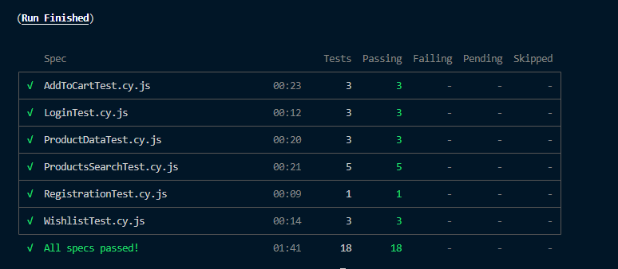
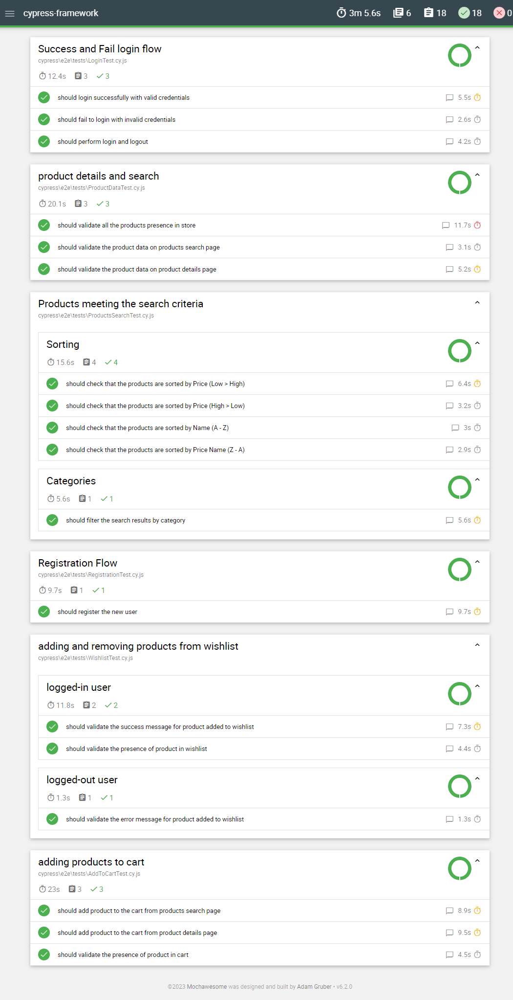
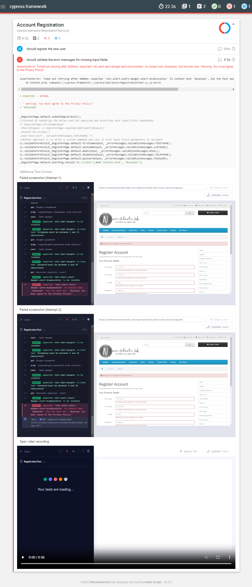
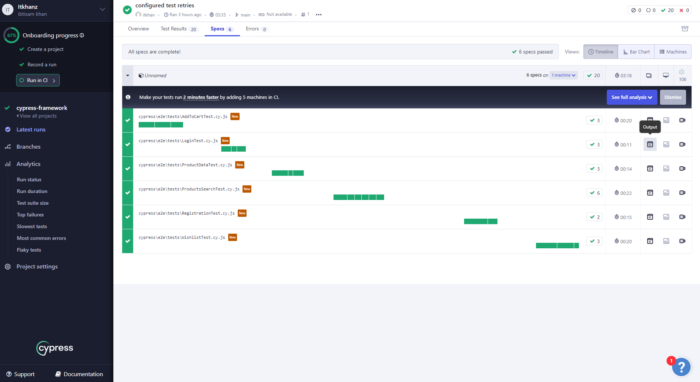
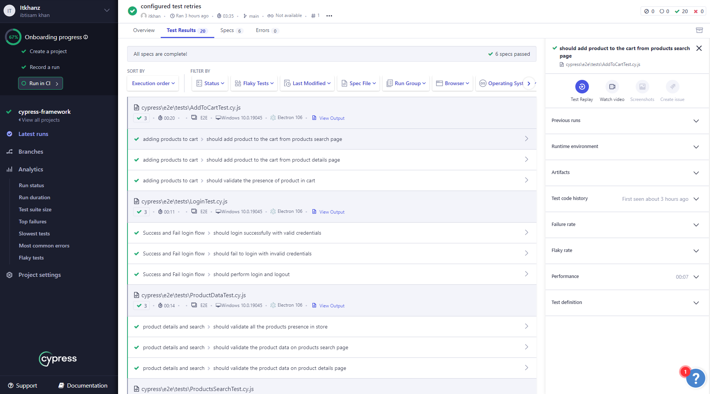
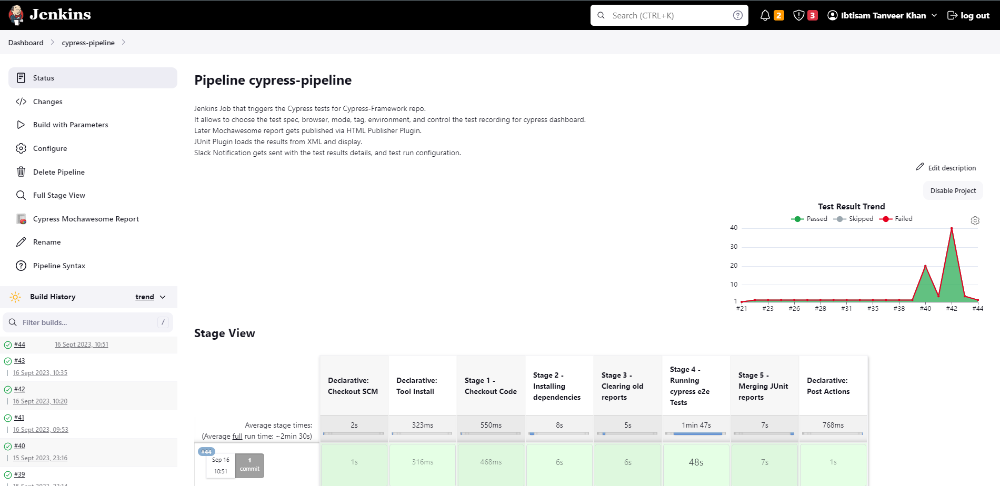
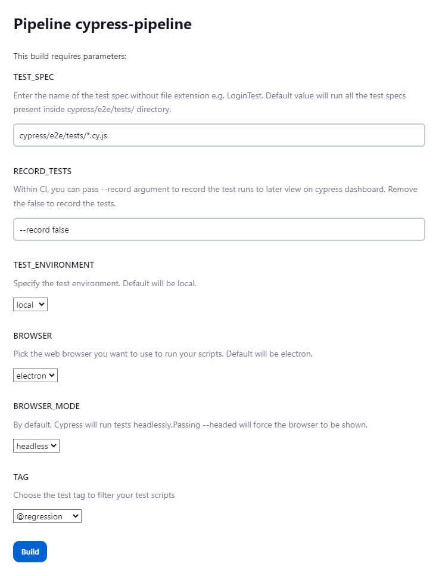
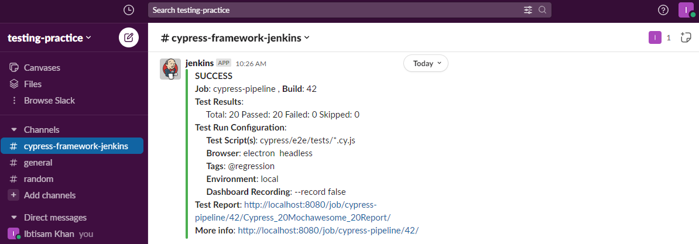

# Cypress Test Automation Framework

[](https://cloud.cypress.io/projects/sh3aqa/runs)
[](https://cloud.cypress.io/projects/sh3aqa/runs)

Cypress test automation framework built with JavaScript (JS) that follows the Page Object Model (POM) design pattern to implement the UI tests for OpenCart E-commerce store.

> If you are a beginner to Cypress, refer to my other repo to refresh your Cypress knowledge which will serve as a starting-point to Cypress testing:
[Cypress-E2E-Web-and-API-Testing](https://github.com/itkhanz/Cypress-E2E-Web-and-API-Testing)

Application Under Test (AUT):
https://naveenautomationlabs.com/opencart/index.php

## Features 💡

* Atomic and Independent test cases
* Robust Locator strategies to target elements
* No hard coded strings and test data in spec files
* Hooks to perform the repeated steps for all the tests inside spec
* Loading test data from external fixtures files i.e. JSON
* Generate random test data with faker library
* Loading environment specific configuration and environment variables per environment i.e. dev, stage, prod
* Ability to filter and run tests with specific tags i.e. regression, smoke
* Pass browser and mode as environment variable
* Configure routes (URL endpoints) in a constant config file
* Usage of OOP Inheritance to extend all the pages from BasePage
  * Allows to load header and footer components from BasePage constructor
  * Call the `cy.visit()` from BasePage with specified path
* Test Retries for failing tests
* Custom commands for login and validation in `cypress/support/commands.js`
* Intellisense for custom commands in `cypress/support/index.d.ts`
* Reusable test utilities functions inside `cypress/e2e/utils` 
* Support for Cypress Cloud (Dashboard)
* Multiple reporters configuration (JUnit XML, cpress-mochawesome-reporter HTML) 
* Cypress with Docker using Dockerfile and docker-compose
* Continuous Integration CI with Jenkins 


## Setup 🛠️

### Pre-requisites

* Install NodeJS and NPM pakcage manager.
* Code Editor of your choice e.g. Visual Studio Code
  * Install [ESLint](https://marketplace.visualstudio.com/items?itemName=dbaeumer.vscode-eslint) VS Code extension from Microsoft to make linting work in IDE
* GIT Client (for remote tracking)
* GIT Bash terminal (for Windows)

#### Optional
* Install [Cypress Snippets](https://marketplace.visualstudio.com/items?itemName=CliffSu.cypress-snippets) VS Code Extension that includes the most common cypress snippets.

### Setup from Scratch

* `npm init` to setup node project with package.json
* `npm install --save-dev cypress` to install cypress as dev dependency
* `npx cypress open` to open the cypress test runner and choose `E2E Testing` which will create cypress config, support and fixture folders.
* Choose browser of your choice, and scaffold examples which will create boilerplate specs within e2e folder.
* Remove the default boilerplate specs from `cypress/e2e` folder
* Add `.gitignore` to exclude files and folders from GIT
* Add `README.md` to document
* Start with writing tests under `cypress/e2e` directory.

#### Integrating ESLint

* Install [ESLint](https://marketplace.visualstudio.com/items?itemName=dbaeumer.vscode-eslint) VS Code extension from Microsoft to make linting work in IDE
* Install eslint in project `npm init @eslint/config --save-dev`
* Install [Cypress ESLint Plugin](https://www.npmjs.com/package/eslint-plugin-cypress) with `npm install eslint-plugin-cypress --save-dev`
* Configure the `.eslintsrc.json` to use recommended settings or add custom rules:
```json
{
  "extends": [
    "plugin:cypress/recommended"
  ]
}
```
* [Linting Cypress code using ESLint and eslint-plugin-cypress](https://www.youtube.com/watch?v=-YgitwmwFo0)

### Using existing framework

* Clone git repo
* Navigate to folder and open terminal
* Run `npm install` to install the framework dependencies

#### Pre-requistes 

* Register with a new user on the website manually for first time.
* Save the login credentials for registered user under `cypress/fixtures/users.json`
* Add the `projectId` for Cypress Cloud in `cypress.config.js`
  
> To add IntelliSense for IDE like VS Code, add the [Triple slash directives](https://docs.cypress.io/guides/tooling/IDE-integration#Triple-slash-directives) to the head of test file or use the [Refernce type declaration via jsconfig.json](https://docs.cypress.io/guides/tooling/IDE-integration#Triple-slash-directives)


--- 

## Configurarion ⚙️

* Project specific constants are defined under `cypress/config/constants.js`
* URL routes for pages are defined under `cypress/config/routes.js`. This allows to open the page directly by calling the `open()` method of page.
* Environment specific Cypress settings are placed inside JSON files per enironment in `settings/{environmentName}.settings.json` file. This allows to load separaete settings per environment.
* [Configuration](https://docs.cypress.io/guides/references/configuration)
* [Cypress.config](https://docs.cypress.io/api/cypress-api/config)
* [How To Load Cypress Settings Per Environment](https://glebbahmutov.com/blog/load-cypress-env-settings/)
* [Cypress basics: Using baseUrl](https://filiphric.com/cypress-basics-using-baseurl)
* 

---

## Running tests ⚡

* [Command Line](https://docs.cypress.io/guides/guides/command-line)
* [Environment Variables](https://docs.cypress.io/guides/guides/environment-variables)
* `npx cypress open` will open the cypress test runner so you can run the tests from it
* `npx cypress run` will run all the test spec files located within `cypress/e2e` folder. By default test are run in headless mode on electron browser.
* If you want to run test on specific browser, you can provide with `--browser` argument like `--browser chrome`.
* To run tests in headed mode, pass argument `--headed`
* To run a specific test spec, use the following cmd syntax:
  `npx cypress run --spec cypress/e2e/tests/AddToCartTest.cy.js --headed --browser chrome` will run the tests from AddToCartTest spec on chrome browser in headed mode.
* Following custom test scripts are setup in `package.json` to run specific test suites in headless format:
  * `npm run test:registration`
  * `npm run test:login`
  * `npm run test:productData`
  * `npm run test:addToCart`
  * `npm run test:wishlist`
  * `npm run test:productSearch`
* You can also filter the tests based on tag by providing `--env grepTags="<tag>"`
  * For example, To run the tests that are tagged as `@smoke`:
    * `npx cypress run --spec cypress/e2e/tests/AddToCartTest.cy.js --env grepTags="@smoke"`
    * To use the command line args with npm run scripts, append an extra `--`
      * `npm run test:addToCart -- --env grepTags="@smoke"`
  * Similarly you can filter the test based on its title by providing ` --env grep="<substring_in_spec_title>`
* To run the tests on any specific browser in headed mode:
  * For example, `npm run test:addToCart -- --env grepTags="@smoke" --headed --browser chrome` will run the smoke tests from addToCart spec on chrome browser in headed mode
* You can also change baseUrl, configuration files and enironment variables during test execution by passing the `environmentName` enviornment variable.
* Summing up all the above configuration, here is an example:
  * `npm run test:registration -- --env environmentName="stage",grepTags="@smoke" --headed --browser chrome` will run tests with following configurations:
    *  **spec** `RegistrationTest.cy.js` 
    *  **browser** `chrome`
    *  **mode** `headed`
    *  **tag** `smoke`
    *  **environmentName** `stage`
    *  **baseUrl** `https://stage.naveenautomationlabs.com/opencart/index.php` is automatically teken from `environmentName`

* You can add cloud execution and test recording to the existing scripts by appending `-- --record --key <key>` to the end of npm test scripts. For example, `npm run test:registration -- --env environmentName="local",grepTags="@smoke" --record --key <KEY_VALUE>`
* Terminal output shows the results summary as: 
  


---

## Test Reporting 📑

* This framework uses [cypress-mochawesome-reporter](https://www.npmjs.com/package/cypress-mochawesome-reporter) to generate HTML test reports.
* Add the following options to `cypress.config.js`
  ```js
   //cypress-mochawesome-reporter
  reporter: 'cypress-mochawesome-reporter',  
  reporterOptions: {
    charts: true, //Genarates Chart in HTML report
    reportPageTitle: 'OpenCart Test Report', //Report title will be set to the mentioned string
    embeddedScreenshots: true, //Screenshot will be embedded within the report
    inlineAssets: true, //No separate assets folder will be created
    videoOnFailOnly: false, //If Videos are recorded and added to the report, setting this to true will add the videos only to tests with failures.
  },
  ```
* HTML Reports are generated by default in `root/cypress/reports` folder.
* It embeds the screenshots of tests on failure automatically to the report, and also attaches the videos to report. 
* It also allows the customization of report with better control of how and where report is generated.
* This is how the report dashboard looks like:
  


* Some ther reporting possibilities are:
  * [mochawesome](https://www.npmjs.com/package/mochawesome)
  * [cypress-allure-plugin](https://www.npmjs.com/package/@shelex/cypress-allure-plugin)
  
* If a test case is failed, then the assertion error, screenshot and video gets attached to report automatically. 
  * When a test retries, Cypress will continue to take screenshots for each failed attempt or cy.screenshot() and suffix each new screenshot with (attempt n), corresponding to the current retry attempt number.

  

  
  ## Multiple Reporters

* [Configure Multiple Reports](https://docs.cypress.io/guides/tooling/reporters)
* Oftentimes we see users wanting the ability to use multiple reporters. When running in CI, you might want to generate a report for junit and perhaps a json report. This is great, but by setting this reporter you won't receive any additional feedback while the tests are running!
* The framework is configured to report JUnit XML reports, as well as mochawesome HTML reports.
  * Install additional dependencies with `npm install --save-dev cypress-multi-reporters mocha-junit-reporter`
  * Specify your reporter and reporterOptions in your Cypress configuration:
```
reporter: 'cypress-multi-reporters',
  reporterOptions: {
    configFile: 'reporter-config.json',
  },
```
* Then add the separate `reporter-config.json` file (defined in your configuration) to enable mochawesome and junit reporters and direct the junit reporter to save separate XML files.
```json
{
	"reporterEnabled": "cypress-mochawesome-reporter, mocha-junit-reporter",
	"mochaJunitReporterReporterOptions": {
		"mochaFile": "cypress/results/junit/results-[hash].xml"
	},
	"cypressMochawesomeReporterReporterOptions": {
        "reportDir": "cypress/results/cypress-mochawesome-reporter",
		"charts": true,
		"reportPageTitle": "OpenCart Test Report",
		"embeddedScreenshots": true,
		"inlineAssets": true,
		"videoOnFailOnly": false
	}
}
```
* Test results are generated under directory:
  * `cypress/results/junit` for JUnit XML reports
  * `cypress/results/cypress-mochawesome-reporter` for mochawesome HTML reports
* In case you want to combine generated XML files into a single one, [junit-report-merger](https://www.npmjs.com/package/junit-report-merger) can be added.
* Add the scripts in `package.json` to delete the reports before test run, and combine  the JUnit XML reports into single XML report after test finishes.
```json
{
    "results-junit:delete": "rm -rf cypress/results/junit/* || true",
    "results-junit:combine": "jrm cypress/results/junit/combined-report.xml \"cypress/results/junit/*.xml\"",
    "report:pre": "npm run results-junit:delete",
    "report:post": "npm run results-junit:combine",
    "test:report": "npm run report:pre && npx cypress run && npm run report:post"
}    
```
* `rm` and `true` are native shell commands and so the above scripts will not run in poweshell terminal, therefore use GIT Bash terminal if you are on windows.
    

---

## Cypress Cloud ☁️

* Record a run to see your test results in Cypress Cloud. You can then optimize your test suite, debug failing and flaky tests, Test Replay, watch video, view console output and screenshots, and integrate with your favorite tools.
* [Cypress Cloud documentation](https://docs.cypress.io/guides/cloud/introduction)
* [Cypress Project ID and Record Key](https://docs.cypress.io/guides/cloud/account-management/projects)
* [Record tests](https://docs.cypress.io/guides/continuous-integration/introduction#Record-tests)
  * Once you set up your project to record, Cypress generates a unique projectId for your project and automatically insert it into your Cypress configuration file. The projectId is a 6 character string in your Cypress configuration.
  * The record key is used to authenticate that your project is allowed to record tests to Cypress Cloud. As long as your record key stays private, no one will be able to record test runs for your project - even if they have your projectId.
  * Create `cypress.env.json` in root directory that Cypress will automatically check. Values in here will overwrite conflicting environment variables in your Cypress configuration.This strategy is useful because if you add cypress.env.json to your `.gitignore` file, the values in here can be different for each developer machine.
  ```json
  {
    "projectId": ""
  }
  ```

* Run the test via `npx cypress run --record --key <record key>`





---

## Docker 🐋

If you want to execute the tests using Docker, you can do the following in your terminal (Powershell) at the workspace project.-

```bash
# Without docker-compose

# Build the docker image from Dockerfile
> docker build -t cypress_docker .

# Run the following command to run all tests with test:all script inside docker
> docker run -i -v ${PWD}:/cypress_docker -t cypress_docker:latest test:all

# You can also pass command line parameters optionally to further narrow down your tests
> docker run -i -v ${PWD}:/cypress_docker -t cypress_docker:latest test:registration -- --env environmentName="local",grepTags="@smoke" --headed --browser chrome
```


```bash
# With docker-compose

# Build the docker image from Dockerfile
> docker build -t cypress_docker .

# Execute the following command to compile the file. <YourVersionTag> may be any value you want
> docker build -t cypress_docker:<YourVersionTag> .

# Then, execute the following command to run the tests inside of the container
> docker-compose up

# To run cross browser tests on multiple browsers
> docker-compose -f docker-compose-browsers up

# To stop the docker compose execution
> docker-compose -f docker-compose-browsers.yml down --volumes --remove-orphans

# You can also combine the building of image and running of test in single step
> docker-compose -f docker-compose-build.yml up --build
```


* For more detail on cypress with docker, read [cypress docker](./doc/docker.md)

## Continuous Integration CI 🚀

The Project is configured to run Cypress in Continuous Integration with multiple CI Providers.

### Jenkins Integration


* This framework supports the Continous Integration CI with Jenkins, and offers fully customize execution with support for:
  * Jenkinsfile Pipeline Script
  * Build with Parameters
    * Allows to select test specs, browser, browser mode, tags, environment, dashboard recording.
  * Publishes Mochawesome HTML report via HTML Publisher Plugin
  * Parses JUnit XML results to display a summary and trends of test results
  * Sends a Slack Notification with test results summary, link to test report, and job.
* See the [Jenkinsfile](./Jenkinsfile) to see how the pipeline is configured.
* For more detail on cypress with Jenkins, read [Cypress Jenkins](./doc/jenkins.md)






