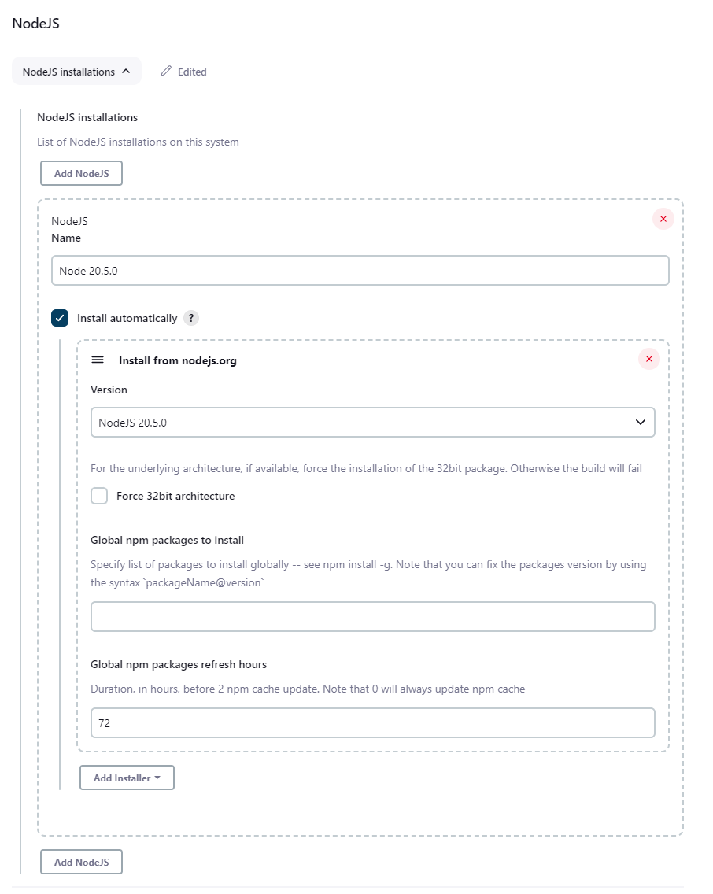
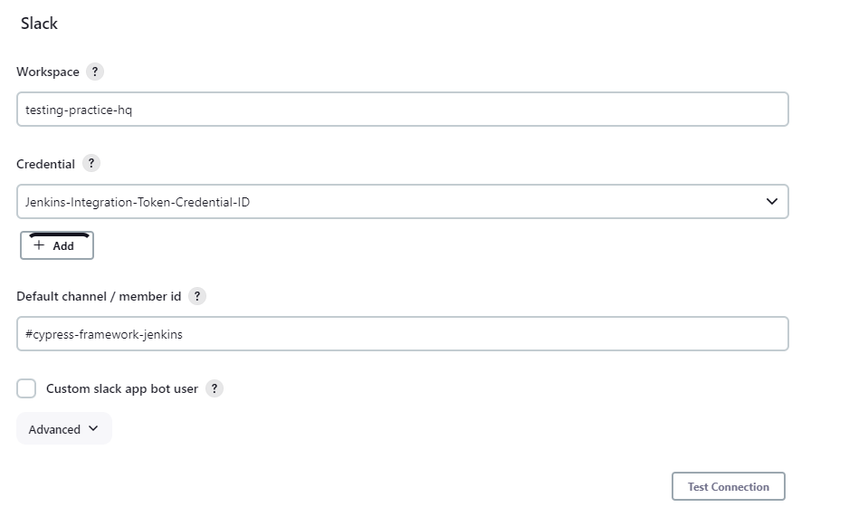
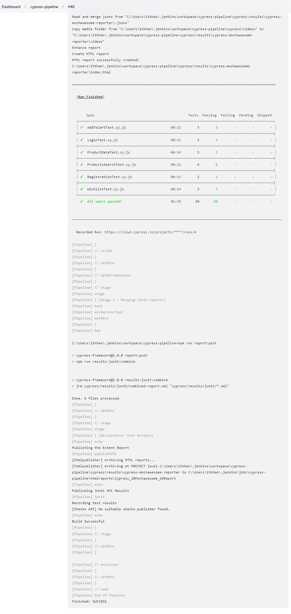

# Running Cypress Tests in Jenkins CI

## Prerequisites

* Ensure you have Java Development Kit (JDK) installed on your Windows machine.
* Download the Jenkins .war file from the official website.
* GIT and GIT BASH

## Setup

* Install Java:
  * Download and install the latest version of the JDK for Windows.
  Set up the JAVA_HOME environment variable to point to your JDK installation directory.
* Download Jenkins .war File:
  * Visit the Jenkins website (https://www.jenkins.io/download/) and download the latest stable .war file.
* Launch Jenkins:
  * Open Command Prompt (CMD) or PowerShell.
  * Navigate to the directory where you downloaded the Jenkins .war file.
* Start Jenkins:
  * Launch Jenkins by running the following command:
```bash
java -Dfile.encoding=UTF-8 -jar jenkins.war
```

> We specify the UTF-8 file encoding to avoid weird output formatting in jenkins job console output. Alternatively you can alse set it in jenkins xml file.
>

* After Jenkins has started, open a web browser and go to http://localhost:8080 (or the port you specified).

* Complete the one-time necessary configiuration steps like installing plugins, creating admin user etc. 

## Configuring Jenkins to run Cypress Tests

* Install following plugins
  * [Jenkins ANI Color Plugin](https://plugins.jenkins.io/ansicolor/) to avoid passing explicitly `NO_COLOR` environment variable to format the cypress output in jenkins console.
  * In `Job Configuration -> Build Environment -> Color ANSI Console Output -> ANSI Color Map xterm`
  * or in Pipeline cnfigure as options in pipeline
    ```groovy
        options {
            ansiColor('xterm')
        }
    ```
    * If you choose not to use ANSI color plugin, then you need to define `NO_COLOR` in pipeline
    ```groovy
        environment {
            NO_COLOR = '1'
        }
    ```
      * if you are on unix you can simply run `sh "NO_COLOR=1" npm run test:all`
      * On Windows, you must run `bat "SET NO_COLOR=1" && npm run test:all`
      * if you are using freestyle project, then you have to declare it in jenkins global environment variables.
    * 
  * [NodeJS Plugin](https://plugins.jenkins.io/nodejs/)
    * Manage Jenkins -> Global Tools Confioguration -> NodeJS Installation, choose the NODE JS  version, and give a name to it, which will then be used in pipeline.
  


  * [HTML Publisher Plugin](https://plugins.jenkins.io/htmlpublisher/)
    * This will allow us to publish Mochawesome HTML reports
    * Jenkins does not allow CSS, and JS in reports so we need to run following groovy script in jenkins when we start the server, so we can view the HTML reports.
    * Manage Jenkins -> Tools and Actions -> Script Console
    ```groovy
    System.setProperty("hudson.model.DirectoryBrowserSupport.CSP", "")
    ```
  * [JUnit Plugin](https://plugins.jenkins.io/junit/) will allow us to display the test results summary, status, and trends in graphical format within Jenkins. 
    * It will parse the combined-result.xml file that is generated in our post report script. 
    * Moreover it will allows us to extract tests count based on the status.
  * [Slack Notification Plugin](https://plugins.jenkins.io/slack/) will enable us to send a slack message
    * Create a Slack Account
    * Create a Workspace
    * In Workspace, click on members, and choose App Integration
    * Select Jenkins App. After Installation
      * We need the following to setup Slack within Jenkins:
        * `Team Subdomain`
        * `Integration Token Credential ID`
    * Go to Manage Jenkins -> Global Configuration, and add configuration for your slack channel, workspace, and add the token already added from secre text credentials.
  
  

* In our test scripts, we need to execute some shell commands that are not available in windows command line or powershell and only available in Bash terminals, so we need to change the default terminal for Jenkins.
  * Go to Manage Jenkins -> Configure System -> Shell executable and specify path to your executable e.g.  `C:\Program Files\Git\usr\bin\sh.exe`


## Add Credentials for Cypress Dashboard in Jenkins

* If we are adding support for recording tests in Cyprss Dashboard, then we need to pass certain environment variables through CI.
* In the "Manage Jenkins" page, click on "Manage Credentials" from the left-hand menu.
* In the "Credentials" page, click on the "Global credentials (unrestricted)" link.
* In the "Global credentials" page, click on the "Add Credentials" link on the left.
* Enter the credentials as `Secret Text` for:
  * `CYPRESS_RECORD_KEY`
  * `CYPRESS_PROJECT_ID`
  
* [Projects](https://docs.cypress.io/guides/cloud/account-management/projects)
* [Set up a project to record](https://docs.cypress.io/guides/cloud/getting-started)
* [cypress ci](https://docs.cypress.io/guides/references/error-messages#You-passed-the---record-flag-but-did-not-provide-us-your-Record-Key)

## Jenkins Pipeline Job

* Choose `Pipeline` as the job type and give it a name.
* In the job configuration, under the `Pipeline` section, select `Pipeline script from SCM` as the Definition.
  * Choose your version control system (e.g., Git) and provide the repository URL.
  * Specify the branch (e.g., main or master) where your Jenkinsfile is located.
  * Add Credentials
* Specify Path to your Jenkinsfile e.g. `Jenkinsfile` since in our case it is located in root directory of our GIT repo.

> First time running the parameterized jenkins script may fail and does not show the `Build with Parameter` options because we only declared them in script. After the first build, Jenkins will update the configuration to add them automatically and displaz build with parameter options.

* Here is how the Jenkins Console Output will look like:



## Resources

* [Cypress CI](https://docs.cypress.io/guides/continuous-integration/introduction)
* [Cypress Jenkins CI](https://docs.cypress.io/guides/continuous-integration/ci-provider-examples#Jenkins)

### Blogs

* [How To Run Cypress Tests In Jenkins Pipeline [Jenkins and Cypress Tutorial]
](https://www.lambdatest.com/blog/jenkins-and-cypress-tutorial/)
* [Integrate Cypress Dashboard with Jenkins and Execute the Test Cases
](https://qaautomationlabs.com/integrate-cypress-dashboard-with-jenkins-and-execute-the-test-cases/)
* [Cypress e2e Testing in the Jenkins Pipeline
](https://ronnieschaniel.medium.com/cypress-e2e-testing-in-the-jenkins-pipeline-cc0a0df29fb6)

### YouTube

* [Cypress Jenkins JoanMedia](https://www.youtube.com/playlist?list=PLYDwWPRvXB89p_NxZJSjsldRR0vUdv3-g
)

### Example Jenkinsfile

* https://github.com/rschaniel/angular_cypress_example/blob/master/Jenkinsfile
* https://github.com/helenanull/cypress-example/blob/main/Jenkinsfile
* https://github.com/JoanEsquivel/cypress-demo-framework/blob/main/Jenkinsfile
* https://github.com/abhinaba-ghosh/cypress-e2e-boilerplate/blob/master/Jenkinsfile
* https://github.com/cypress-io/cypress-example-kitchensink/blob/master/basic/* Jenkinsfile
* https://github.com/cypress-io/cypress-example-kitchensink/blob/master/Jenkinsfile

### Stack Overflow Issues

* [Change Windows shell in Jenkins (from Cygwin to Git Bash/msys)](https://stackoverflow.com/questions/35043665/change-windows-shell-in-jenkins-from-cygwin-to-git-bash-msys)
* [Jenkins: console output characters](https://stackoverflow.com/questions/27960996/jenkins-console-output-characters)
* [Jenkins Console Print Encoded Characters](https://stackoverflow.com/questions/51993828/jenkins-console-print-encoded-characters)
* [Show mochaawesome html report in jenkins](https://github.com/adamgruber/mochawesome/issues/180)
* [Cypress CLI console output not very readable](https://stackoverflow.com/questions/48634725/cypress-cli-console-output-not-very-readable)
* [Cypress CI Colors](https://docs.cypress.io/guides/continuous-integration/introduction#Colors)
* [How do I set a default choice in jenkins pipeline?](https://stackoverflow.com/questions/47873401/how-do-i-set-a-default-choice-in-jenkins-pipeline)
* [Cannot define variable in pipeline stage](https://stackoverflow.com/questions/39832862/cannot-define-variable-in-pipeline-stage)
* [Jenkins - HTML Publisher Plugin - No CSS is displayed when report is viewed in Jenkins Server](https://stackoverflow.com/questions/35783964/jenkins-html-publisher-plugin-no-css-is-displayed-when-report-is-viewed-in-j)
* [How to create JUnit Report in Jenkins](https://qaautomation.expert/2022/12/14/how-to-create-junit-report-in-jenkins/)
* [How to access Junit test counts in Jenkins Pipeline project](https://stackoverflow.com/questions/39920437/how-to-access-junit-test-counts-in-jenkins-pipeline-project)
* [Test results are displayed with duplicate entries for failures in Jenkins](https://stackoverflow.com/questions/42427266/test-results-are-displayed-with-duplicate-entries-for-failures-in-jenkins)
